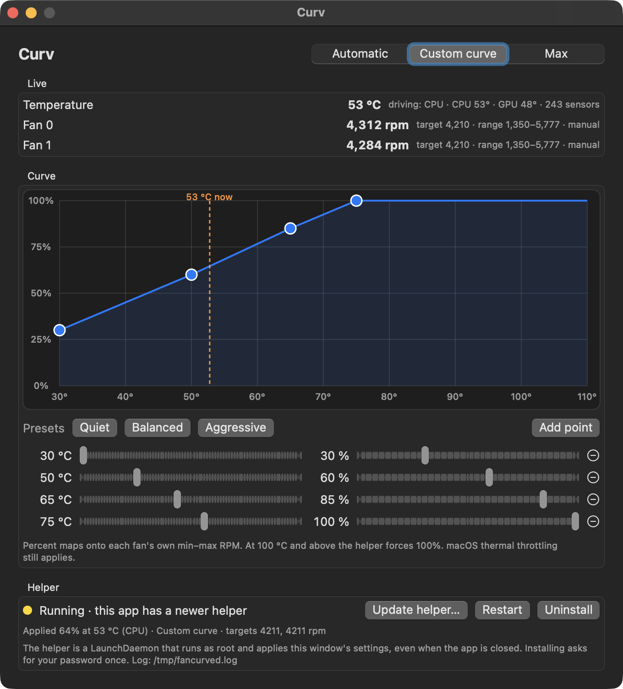
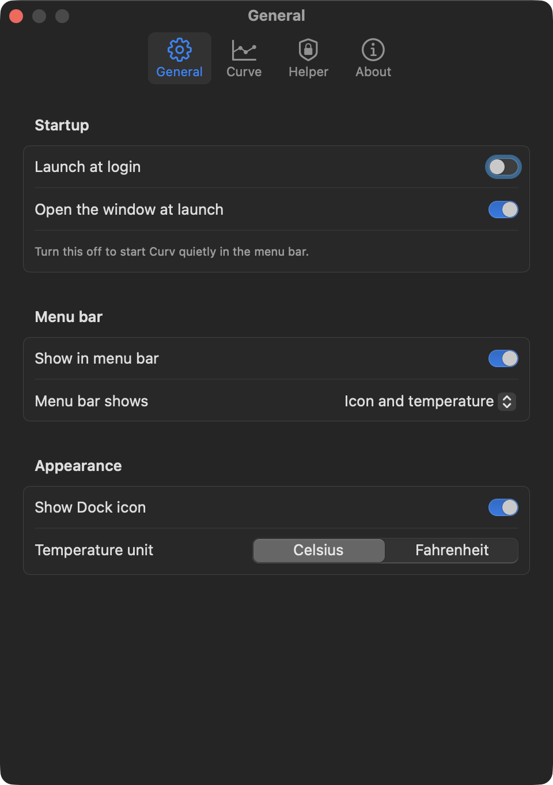

# Curv

Draw a fan curve for an Apple Silicon Mac. A small root helper keeps the fans
on it, even when the app is closed.



Curv has three modes. **Automatic** leaves the fans to macOS. **Custom curve**
maps the hotter of the CPU-die average and the GPU average onto a fan percent
you draw. **Max** pins every fan at its top speed.

It lives in the menu bar too: the fan icon shows the current temperature or
fan speed, and its menu switches mode and preset without opening the window.
Settings (⌘,) cover launch at login, menu bar and Dock visibility, opening
quietly in the menu bar, Celsius or Fahrenheit, the sensor that drives the
curve, the safety floor, and the helper's interval. Check for Updates looks at
the latest GitHub release.



## Install

Download `Curv-<version>.zip` from [Releases](https://github.com/romankhadka/curv/releases),
unzip it, and move **Curv.app** to your Applications folder.

The build is signed ad hoc and is not notarised by Apple, so macOS quarantines
it on download. Clear that once:

```sh
xattr -dr com.apple.quarantine /Applications/Curv.app
```

Open Curv and click **Install…** in the Helper box. macOS asks for your
password once. That installs the helper daemon; the fans follow the window from
then on.

Requires macOS 15 or newer on Apple Silicon.

## Build from source

Needs Xcode or the Command Line Tools.

```sh
git clone https://github.com/romankhadka/curv.git
cd curv
./build.sh
open build/Curv.app
```

## How it works

- **Curv.app** reads fan RPM and every SMC temperature key. Reads need no
  privileges. It saves your curve to
  `~/Library/Application Support/FanCurve/config.json` as you edit.
- **fancurved** is a LaunchDaemon that runs as root. Every 2 seconds (adjustable
  in Settings) it reads that file, averages the CPU-die keys (`Tp*`) and the
  GPU keys (`Tg*`), takes the hotter one or the one you chose, interpolates the
  curve, and writes each fan's target RPM through the SMC. Percent maps onto
  each fan's own minimum and maximum.
- The daemon hands control back to macOS when it stops, when the mode is
  Automatic, or when no temperature reading is available.
- At **100 °C** or above (adjustable) it forces 100% regardless of the curve.
  macOS thermal throttling stays in force at all times; Curv only sets fan targets.
- When a new Curv ships a newer helper, the app shows **Update helper…** and
  reinstalls it with one password prompt.

Single core sensors on Apple Silicon spike far above the package temperature
under load, so the curve is driven by averages, not by the hottest key. List
every key with:

```sh
.build/release/fancurved --sensors
```

## Files the helper installs

| Path | Purpose |
|---|---|
| `/Library/PrivilegedHelperTools/com.romn.fancurved` | the daemon |
| `/Library/LaunchDaemons/com.romn.fancurved.plist` | starts it at boot, keeps it alive |
| `/tmp/fancurved.log` | daemon log |
| `/tmp/fancurved.status.json` | heartbeat the app reads |

**Uninstall** in the Helper box removes the first two, stops the daemon, and
returns the fans to macOS.

## Layout

```
Sources/CSMC       C bridge to AppleSMC (IOKit)
Sources/SMCKit     Swift wrapper, config model, curve interpolation
Sources/fancurved  root daemon
Sources/Curv       SwiftUI app: window, menu bar, settings
Resources/         app icon (regenerate with scripts/make_icon.swift)
docs/              curv.romn.dev
```

## License

MIT. See [LICENSE](LICENSE).
